# 💊 Assistant Médicaments RAG

Ce projet est un système de **RAG (Retrieval-Augmented Generation)** complet construit à partir de zéro (sans LangChain ni LlamaIndex) pour répondre de façon fiable et sécurisée à des questions sur un corpus de médicaments courants en utilisant **Groq (LLM Llama 3)** et **FAISS** pour la recherche vectorielle.

---

## 📚 Réponses aux Questions de Réflexion (Sujet B)

### **Q1. Stratégie de chunking et taille appropriée**
Les notices de médicaments sont denses et longues. Pour éviter le chevauchement de sujets critiques, notre stratégie effectue un **découpage sémantique par section** (composition, posologie, contre-indications, effets indésirables, etc.) avant de découper le texte. Si une section dépasse la taille maximale, elle est découpée par le `chunker` avec un seuil de `taille_max = 800` caractères et un `overlap = 150` caractères. Cette taille permet de conserver une idée médicale entière (1 à 2 paragraphes ou listes à puces) sans diluer les embeddings.

### **Q2. Exploitation de la structure des notices**
Oui, chaque rubrique de la notice (`posologie`, `contre_indications`, etc.) est indexée comme un document distinct. Lors de l'indexation, nous insérons le contexte structurel directement dans le texte à embedder sous la forme :  
`Médicament: [Nom] | Rubrique: [Section] | Contenu: [Texte]`  
Cela renforce considérablement l'alignement sémantique lors de la recherche de questions ciblant une rubrique spécifique.

### **Q3. Distinction effets secondaires vs. posologie**
Grâce au préfixage sémantique décrit en Q2, les termes "posologie", "effets indésirables" ou leurs synonymes sémantiques sont présents dans l'embedding calculé. Ainsi, une question comme *"Quels sont les risques du Doliprane ?"* s'alignera naturellement avec les vecteurs commençant par `Rubrique: Effets indésirables` ou `Rubrique: Contre-indications`. De plus, les métadonnées structurées stockées dans `metadata.json` nous permettent de tracer et de citer précisément la rubrique source dans l'interface utilisateur.

### **Q4. Gestion des questions multi-médicaments**
Lorsqu'un utilisateur demande : *"Puis-je prendre du Doliprane et de l'ibuprofène en même temps ?"*, la recherche vectorielle extrait le `top-k` (ici $k=4$) des chunks les plus proches. L'embedding de la question contenant des termes liés aux deux molécules, FAISS récupère les sections d'interactions et de contre-indications des deux notices. Le LLM fusionne ensuite ces informations et fournit une analyse comparative sécurisée en citant chaque source séparément.

### **Q5. Formulation du prompt système et prudence médicale**
Le prompt système impose une rigueur absolue :
1. **Mention légale obligatoire** en fin de réponse : *"Ces informations ne remplacent pas l'avis d'un professionnel de santé."*
2. **Traçabilité stricte** : Citer le médicament et la rubrique pour chaque affirmation clé.
3. **Garde-fou anti-hallucination** : Obligation de répondre *"Je ne trouve pas cette information dans ma base de connaissances."* si le score L2 dépasse le seuil de sécurité ou si les notices ne contiennent pas la réponse.
4. **Basse température** (`temperature=0.1`) pour garantir des réponses déterministes et fidèles.

---

## ⚙️ Architecture du Système

Le système est divisé en deux phases étanches :

```mermaid
flowchart TD
    subgraph Ingestion [Phase 1 : Ingestion & Indexation]
        A[CIS_RCP_export.xlsx] --> B[Dédoublonnement & Sélection de la notice la plus complète]
        B --> C[Découpage par rubrique & sémantique chunker]
        C --> D[Modèle Embedding : paraphrase-multilingual-mpnet-base-v2]
        D --> E[(Index FAISS persistant : faiss_index.bin)]
        C --> F[(Métadonnées : metadata.json)]
    end

    subgraph RAG [Phase 2 : RAG Interactif]
        G[Question Utilisateur] --> H[LLM Groq : Reformulation via Historique]
        H --> I[Question Optimisée]
        I --> J[Embedding de la Question]
        J --> K[Recherche Vectorielle FAISS L2]
        K --> L[Vérification du Seuil de Confiance Score L2]
        L -->|Hors-Sujet / Seuil Dépassé| M[Refus de répondre sécurisé]
        L -->|Valide / Top-4 Chunks| N[LLM Groq : Llama 3 Synthèse & Disclaimer]
        N --> O[Réponse finale avec citations & sources]
    end
```



---

## 🚀 Lancement du Projet

### 1. Prérequis
Créez et activez votre environnement virtuel, puis installez les dépendances :
```bash
python3 -m venv venv
source venv/bin/activate
pip install -r requirements.txt --index-url https://pypi.org/simple
```

### 2. Ingestion & Indexation (Phase 1)
Exécutez le script d'indexation pour créer la base vectorielle :
```bash
python3 indexation.py
```
*Note : Le script filtre les 18 médicaments cibles, conserve la notice la plus complète pour chacun d'eux afin d'éliminer les redondances, et génère 842 chunks pertinents en moins de 15 secondes.*

### 3. Assistant RAG (Phase 2)
Lancez l'assistant interactif :
```bash
python3 rag.py
```
Si aucune variable `GROQ_API_KEY` n'est détectée dans votre environnement ou votre fichier `.env`, l'assistant vous demandera de la saisir de manière sécurisée et l'enregistrera automatiquement dans un fichier `.env` local.

---

## 🌟 Améliorations Implémentées (Bonus)

1. **Bonus A & C - Gestion de l'historique & Reformulation** : Le système conserve l'historique de la session. Avant la recherche FAISS, il utilise le LLM pour reformuler la question actuelle en fonction du contexte (ex: transformer *"et ses effets secondaires ?"* en *"quels sont les effets indésirables de l'ibuprofène ?"*).
2. **Bonus B - Score de confiance sémantique** : Nous mesurons la distance L2 retournée par FAISS. Si le score le plus proche est supérieur à `24.0` (distance sémantique trop élevée), le système indique poliment qu'il n'a pas l'information pour éviter toute hallucination hors-sujet.
