# 💊 Assistant Médicaments RAG

Ce projet est un système de **RAG (Retrieval-Augmented Generation)** complet construit de bout en bout (sans LangChain ni LlamaIndex) pour répondre de façon fiable et chaleureuse à des questions sur un corpus de médicaments courants en utilisant **Groq (Llama 3.1)**, **Vertex AI (Gemini 2.5 Flash)** et **FAISS** pour la recherche vectorielle.

---

## 📚 Réponses aux Questions de Réflexion (Sujet B)

### **Q1. Stratégie de chunking et taille appropriée**
Les notices de médicaments sont denses et longues. Pour éviter le chevauchement de sujets critiques, notre stratégie effectue un **découpage sémantique par section** (composition, posologie, contre-indications, effets indésirables, etc.) avant de découper le texte. Si une section dépasse la taille maximale, elle est découpée par le `chunker` avec un seuil de `taille_max = 800` caractères et un `overlap = 150` caractères. Cette taille permet de conserver une idée médicale entière (1 à 2 paragraphes ou listes à puces) sans diluer les embeddings.

### **Q2. Exploitation de la structure des notices**
Oui, chaque rubrique de la notice (`posologie`, `contre_indications`, etc.) est indexée comme un document distinct. Lors de l'indexation, nous insérons le contexte structurel directement dans le texte à embedder sous la forme :  
`Médicament: [Nom] | Rubrique: [Section] | Contenu: [Texte]`  
Cela renforce considérablement l'alignement sémantique lors de la recherche de questions ciblant une rubrique spécifique.

### **Q3. Distinction effets secondaires vs. posologie**
Grâce au préfixage sémantique décrit en Q2, les termes "posologie", "effets indésirables" ou leurs synonymes sémantiques sont présents dans l'embedding calculé. Ainsi, une question comme *"Quels sont les risques du Doliprane ?"* s'alignera naturellement avec les vecteurs commençant par `Rubrique: Effets indésirables` ou `Rubrique: Contre-indications`. De plus, les métadonnées structurées stockées dans `metadata.json` nous permettent de tracer et de citer précisément la rubrique source dans l'interface utilisateur.

### **Q4. Gestion des questions multi-médicaments**
Lorsqu'un utilisateur demande : *"Puis-je prendre du Doliprane et de l'ibuprofène en même temps ?"*, la recherche vectorielle extrait le `top-k` (ici $k=4$) des chunks les plus proches. L'embedding de la question contenant des termes liés aux deux molécules, FAISS récupère les sections d'interactions et de contre-indications des deux notices. Le LLM fusionne ensuite ces informations et fournit une analyse comparative en citant chaque source séparément.

### **Q5. Formulation du prompt système et prudence médicale**
Le prompt système configure l'assistant pour agir comme un **médecin de famille bienveillant** :
1. **Mention légale obligatoire** en fin de réponse : *"Ces informations ne remplacent pas l'avis d'un professionnel de santé. En cas de doute, consultez votre médecin ou votre pharmacien."*
2. **Traçabilité stricte** : Citer la notice officielle et la rubrique sémantique pour chaque affirmation issue de la base vectorielle locale.
3. **Soutien médical général** : Si l'utilisateur pose des questions sur des maladies non indexées (ex: le paludisme) ou décrit des symptômes généraux, l'assistant fournit des conseils généraux fiables basés sur ses connaissances médicales, l'oriente chaleureusement vers un médecin, et évite de refuser de répondre de façon sèche.
4. **Dialogue fluide** : Utilisation d'une température de `0.25` pour assurer un ton humain, empathique et naturel, tout en conservant une exactitude factuelle rigoureuse.

---

## ⚙️ Architecture du Système

Le système est divisé en deux phases :

```mermaid
flowchart TD
    subgraph Ingestion [Phase 1 : Ingestion & Indexation]
        A[CIS_RCP_export.xlsx] --> B[Dédoublonnement & Sélection de la notice la plus complète]
        B --> C[Découpage par rubrique & sémantique chunker]
        C --> D[Modèle Embedding : paraphrase-multilingual-mpnet-base-v2]
        D --> E[(Index FAISS persistant : faiss_index.bin)]
        C --> F[(Métadonnées : metadata.json)]
    end

    subgraph RAG [Phase 2 : RAG & Médecin Virtuel]
        G[Question / Salutations / Symptômes] --> H[LLM Groq : Reformulation via Historique]
        H --> I[Question Optimisée]
        I --> J[Recherche Vectorielle FAISS L2]
        J --> K[Filtrage des Chunks avec Seuil L2 <= 24.0]
        K -->|Aucun Chunk Valide / Symptômes| L[Mode Médecin Conseil : Conseils Généraux & Disclaimer]
        K -->|Chunks Valides / Notices| M[Mode RAG Grounding : Synthèse des Notices, Citations & Disclaimer]
    end
```



---

## 🚀 Lancement et Utilisation du Projet

### 1. Prérequis & Dépendances
Créez et activez votre environnement virtuel, puis installez les dépendances requises :
```bash
python3 -m venv venv
source venv/bin/activate
pip install -r requirements.txt --index-url https://pypi.org/simple
```

### 2. Ingestion & Indexation (Phase 1)
Exécutez le script d'indexation pour créer la base vectorielle en 15 secondes :
```bash
python3 indexation.py
```

### 3. Lancement de l'Interface Graphique Streamlit Premium
Démarrez la superbe interface graphique Web "style Gemini" (sans réglages distrayants, clé API lue silencieusement depuis le fichier `.env` local) :
```bash
venv/bin/streamlit run app.py
```
👉 *L'interface est accessible sur http://localhost:8501*

### 4. Lancement de l'Agent Officiel Google ADK
Lancez l'interface graphique officielle de chat ADK avec votre agent configuré sous le modèle **`gemini-3-flash-preview`** :
```bash
venv/bin/adk web
```
👉 *L'interface officielle ADK est accessible sur http://localhost:8000*

---

## 🌟 Améliorations Implémentées (Bonus)

1. **Bonus A & C - Historique & Reformulation Contextuelle** : L'historique des conversations est géré sous le capot. L'assistant reformule à la volée les questions incomplètes (ex: *"quels sont ses effets ?"* devient *"quels sont les effets secondaires du paracétamol ?"*) pour assurer le succès de la recherche FAISS.
2. **Bonus B - Mode Médecin Hybride (Score de Confiance)** : Si la distance L2 de FAISS dépasse `24.0` (hors base), l'agent passe en mode médecin de famille. Il fournit des explications bienveillantes sur les maladies (ex: le paludisme) ou symptômes, sans bloquer de façon abrupte, tout en garantissant la sécurité légale avec la mention obligatoire.
